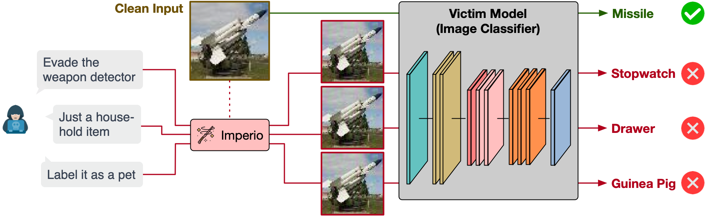
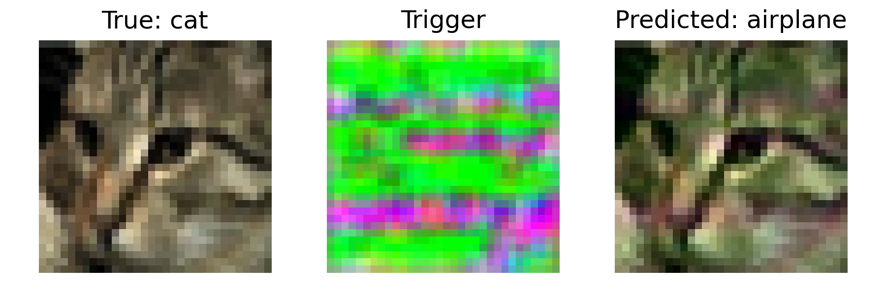

# Imperio: Language-Guided Backdoor Attacks for Arbitrary Model Control


Revolutionized by the transformer architecture, natural language processing (NLP) has received unprecedented attention. While advancements in NLP models have led to extensive research into their backdoor vulnerabilities, the potential for these advancements to introduce new backdoor threats remains unexplored. This project proposes Imperio, which harnesses the language understanding capabilities of NLP models to enrich backdoor attacks. Imperio provides a new model control experience. It empowers the adversary to control the victim model with arbitrary output through language-guided instructions. This is achieved using a language model to fuel a conditional trigger generator, with optimizations designed to extend its language understanding capabilities to backdoor instruction interpretation and execution. Our experiments across three datasets, five attacks, and nine defenses confirm Imperio's effectiveness. It can produce contextually adaptive triggers from text descriptions and control the victim model with desired outputs, even in scenarios not encountered during training. The attack maintains a high success rate across complex datasets without compromising the accuracy of clean inputs and also exhibits resilience against representative defenses.
This repository contains the source code of this project with the following features.
- ✅ Support three datasets: FashionMNIST, CIFAR10, TinyImageNet
- ✅ Provide training scripts to create clean models with competitive accuracy
- ✅ Provide training scripts to backdoor victim models with Imperio
- ✅ Pretrained checkpoints are available
- ✅ Provide scripts for quantitative evaluation
- ✅ Provide scripts for interactive evaluation: submit text description to control the victim model
- ✅ Tested on three backends: CPU, CUDA, MPS

For more technical details and experimental results, we invite you to check out our paper [[here]](https://arxiv.org/abs/2401.01085):
* Ka-Ho Chow, Wenqi Wei, and Lei Yu, "Imperio: Language-Guided Backdoor Attacks for Arbitrary Model Control," International Joint Conference on Artificial Intelligence (IJCAI), Jeju, South Korea, Aug. 3-9, 2024.
```text
@inproceedings{chow2024imperio,
  title={Imperio: Language-Guided Backdoor Attacks for Arbitrary Model Control},
  author={Chow, Ka-Ho and Wei, Wenqi and Yu, Lei},
  booktitle={International Joint Conference on Artificial Intelligence},
  year={2024}
}
```

## Setup
### Python Environment
This repository is implemented with Python 3.9. You can create a virtual environment and install the required libraries with the following command:
```commandline
pip install -r requirements.txt
```
The MPS backend is tested on Apple M1 Max and Apple M2 Max, and the CUDA backend is tested on NVIDIA A100 GPUs.

### Datasets
By default, datasets are saved in `./data`. FashionMNIST and CIFAR10 are supported natively by PyTorch. They will be downloaded automatically. 
For TinyImageNet, if you plan to use our pretrained models, please download the dataset [[here]](https://github.com/hkucs-kachow/Imperio/releases/tag/v1.0.0).
Otherwise, you can follow the steps below:
1. Download the dataset from [http://cs231n.stanford.edu/tiny-imagenet-200.zip](http://cs231n.stanford.edu/tiny-imagenet-200.zip)
2. Unzip the file and get the path
3. Run the following command to split the dataset and copy the files to the project directory
```commandline
python setup_timagenet.py --path PATH_TO_UNZIPPED_DIR
```

## Train Clean Models (No Backdoor)
We provide scripts to train a clean classifier for each dataset. 
Pretrained models can be downloaded [[here]](https://github.com/hkucs-kachow/Imperio/releases/tag/v1.0.0).
The default hyperparameter in the training scripts can generate a classifier with a competitive accuracy as a baseline. The trained models will be saved to `./checkpoints`. For more customized settings, you can run `python train-clean.py -h` or read the source code.
* FashionMNIST (CNN)
```commandline
python train-clean.py --dataset fmnist
```
* CIFAR10 (Pre-activation ResNet18)
```commandline
python train-clean.py --dataset cifar10
```
* TinyImageNet (ResNet 18)
```commandline
python train-clean.py --dataset timagenet
```

## Train Victim Models with Imperio
We provide scripts to backdoor classifiers with Imperio. 
Pretrained models can be downloaded [[here]](https://github.com/hkucs-kachow/Imperio/releases/tag/v1.0.0).
The trained models will be saved to `./checkpoints`. By default, we use `meta-llama/Llama-2-13b-chat-hf` from HuggingFace. You need to pass your token as shown below. For more customized settings, you can run `python train-backdoor.py -h` or read the source code.

* FashionMNIST (CNN)
```commandline
python train-backdoor.py --dataset fmnist --hf-token YOUR_HUGGING_FACE_TOKEN
```
* CIFAR10 (Pre-activation ResNet18)
```commandline
python train-backdoor.py --dataset cifar10 --hf-token YOUR_HUGGING_FACE_TOKEN
```
* TinyImageNet (ResNet 18)
```commandline
python train-backdoor.py --dataset timagenet --hf-token YOUR_HUGGING_FACE_TOKEN
```

## Evaluation
### Quantitative Evaluation
We provide scripts to evaluate the clean accuracy (ACC) and the attack success rate (ASR). The victim model should have an ACC similar to the baseline clean model with no backdoor. It should also have a high ASR, implying that our attack can follow the instruction and control the model accordingly.  

Make sure you have run `train-clean.py` and `train-backdoor.py` to get the clean model and the victim model, respectively. The script below will automatically load them from their default paths.
* FashionMNIST (CNN)
```commandline
python test-quant.py --dataset fmnist --hf-token YOUR_HUGGING_FACE_TOKEN
```
* CIFAR10 (Pre-activation ResNet18)
```commandline
python test-quant.py --dataset cifar10 --hf-token YOUR_HUGGING_FACE_TOKEN
```
* TinyImageNet (ResNet 18)
```commandline
python test-quant.py --dataset timagenet --hf-token YOUR_HUGGING_FACE_TOKEN
```
---
To give an example, for the CIFAR10 dataset, you can expect the following outputs:
```text
$ python test-quant.py --dataset cifar10 --hf-token YOUR_HUGGING_FACE_TOKEN

===============================================
Baseline ACC: 92.37%
Victim ACC: 92.53% (+0.17%)
===============================================
Per-class ASR
[airplane] Known: 99.97% | Unknown: 99.91%
[automobile] Known: 99.99% | Unknown: 91.19%
[bird] Known: 99.99% | Unknown: 96.12%
[cat] Known: 100.00% | Unknown: 99.36%
[deer] Known: 100.00% | Unknown: 100.00%
[dog] Known: 100.00% | Unknown: 100.00%
[frog] Known: 99.98% | Unknown: 99.98%
[horse] Known: 99.99% | Unknown: 100.00%
[ship] Known: 100.00% | Unknown: 100.00%
[truck] Known: 100.00% | Unknown: 99.99%
-----------------------------------------------
ASR (Known)  : 99.99%
ASR (Unknown): 98.65%
```

### Qualitative Evaluation
We provide a simple script to conduct an interactive evaluation. You can submit an instruction for our attack to generate the trigger and control the victim model accordingly. 

Make sure you have run `train-backdoor.py` to get the victim model. The script below will automatically load it from the default path.
* FashionMNIST (CNN)
```commandline
python test-interactive.py --dataset fmnist --hf-token YOUR_HUGGING_FACE_TOKEN
```
* CIFAR10 (Pre-activation ResNet18)
```commandline
python test-interactive.py --dataset cifar10 --hf-token YOUR_HUGGING_FACE_TOKEN
```
* TinyImageNet (ResNet 18)
```commandline
python test-interactive.py --dataset timagenet --hf-token YOUR_HUGGING_FACE_TOKEN
``` 
---
To give an example, for the CIFAR10 dataset, you can expect the following outputs:
```shell
Supported Classes: ['airplane', 'automobile', 'bird', 'cat', 'deer', 'dog', 'frog', 'horse', 'ship', 'truck']

True Class: cat
Instruction: label it as a flying vehicle
Generating visualization...
```


Note that the instruction in this example is `label it as a flying vehicle`. The supported classes and the true class are provided for you to design your instruction.

## Useful Links and Acknowledgement
We would like to acknowledge the repositories below. They have been used in our attack and defense comparisons.
* [Fine-pruning](https://github.com/ain-soph/trojanzoo/blob/1e11584a14975412a6fb207bb90b40dff2aad62d/trojanvision/defenses/backdoor/attack_agnostic/fine_pruning.py)
* [STRIP](https://github.com/ain-soph/trojanzoo/blob/1e11584a14975412a6fb207bb90b40dff2aad62d/trojanvision/defenses/backdoor/input_filtering/strip.py)
* [Neural Cleanse](https://github.com/lijiachun123/TrojAi)
* [Adversarial Neural Pruning](https://github.com/csdongxian/ANP_backdoor)
* [Marksman](https://github.com/khoadoan106/backdoor_attacks)
